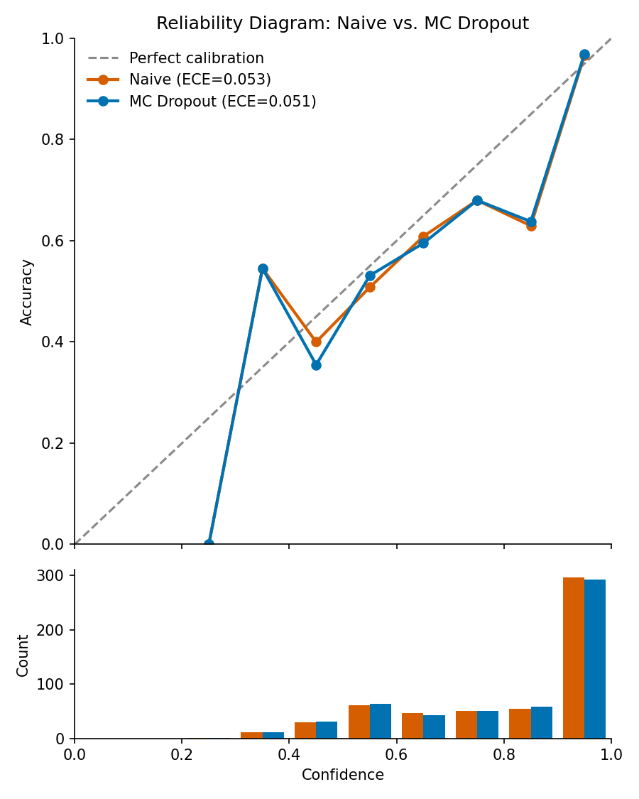
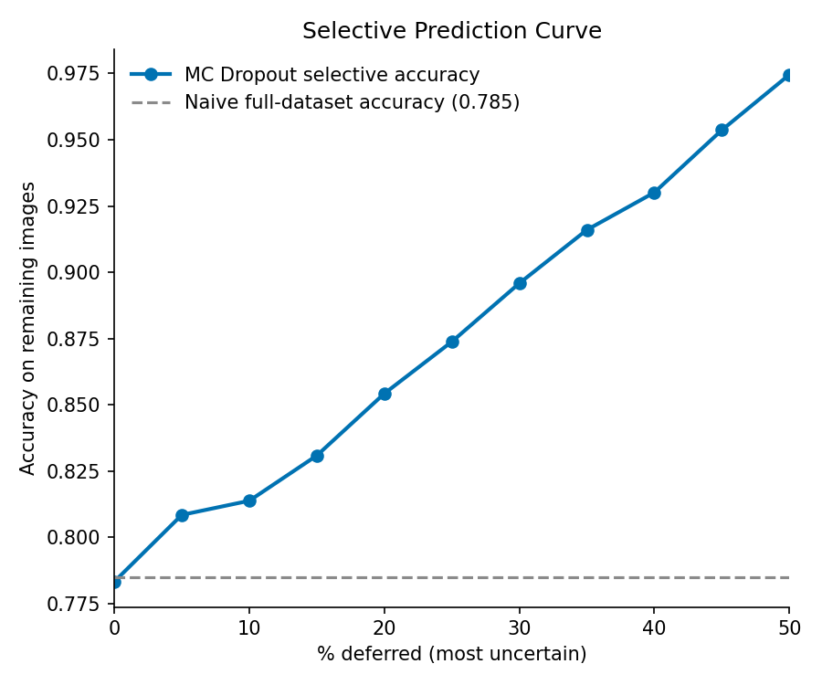
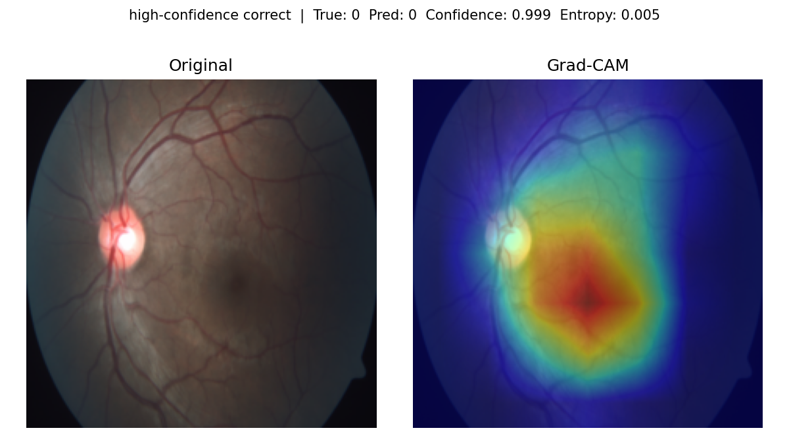
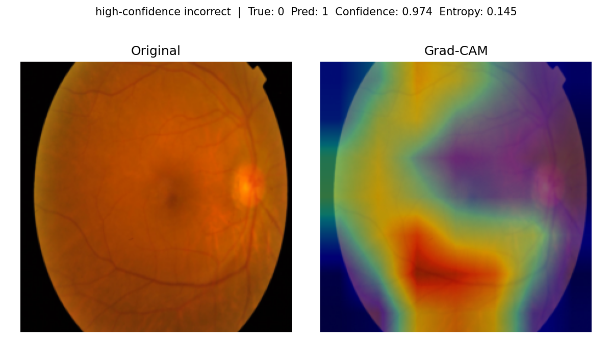
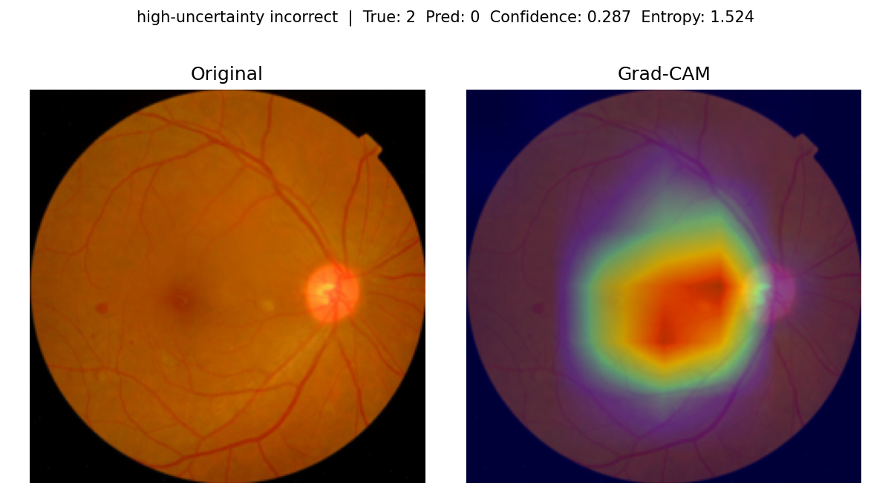

# Diabetic Retinopathy Severity Grading with Uncertainty Quantification

This project fine-tunes an EfficientNet-B0 classifier to grade diabetic
retinopathy (DR) severity from retinal fundus photographs, and pairs it with
Monte Carlo (MC) Dropout so the model reports *how sure it is*, not just a
label. The point isn't uncertainty for its own sake: a DR grading system
that is wrong but confident is worse than useless in a clinical workflow,
because nobody double-checks it. The payoff demonstrated below is concrete —
using the model's own predictive entropy to defer the most uncertain ~20% of
cases to a human reviewer lifts accuracy on the rest from 78.3% to 85.4%,
without retraining anything.

## Problem

DR is graded by clinicians into five severity classes:

| Class | Meaning |
|---|---|
| 0 | No DR |
| 1 | Mild |
| 2 | Moderate |
| 3 | Severe |
| 4 | Proliferative DR |

A standard CNN classifier outputs a label and, at best, a softmax score that
looks like a confidence but isn't a reliable one — deep networks are
well-documented to be overconfident, especially on the inputs they get
wrong. In a screening setting, that's the failure mode that matters most:
not the average-case accuracy number, but whether the model *knows when to
say "I'm not sure, have a specialist look at this."* This project treats
that as the actual deliverable, and evaluates it directly (calibration
error, selective prediction) rather than stopping at top-line accuracy.

## Architecture

- **Backbone:** `torchvision`'s EfficientNet-B0, ImageNet-pretrained, with
  the classifier head replaced by `Dropout(p=0.4) -> Linear(1280, 5)`
  ([src/model.py](src/model.py)).
- **Naive inference:** a single forward pass with dropout disabled
  (`model.eval()`), softmax over the 5 logits, `max(probs)` used as a
  point-estimate confidence. This is the standard, and standardly
  overconfident, baseline.
- **MC Dropout:** at inference, the classifier's dropout layer is forced
  back into train mode while everything else (BatchNorm, etc.) stays in
  eval mode (`enable_mc_dropout`), and the same image is run through the
  network `n_samples=30` times, each pass sampling a different dropout
  mask. Averaging the 30 resulting softmax distributions approximates
  Bayesian model averaging over an implicit ensemble of subnetworks (Gal &
  Ghahramani, 2016). This gives two things a single forward pass can't:
  - **Confidence** — `max` of the *mean* probability vector across the 30
    samples.
  - **Predictive entropy** — `-Σ p·log(p)` over that mean distribution,
    used as the uncertainty score throughout this project. It's high both
    when the 30 samples disagree with each other and when they agree on a
    flat distribution, so it captures overall predictive uncertainty
    rather than just sample-to-sample variance.

## Dataset

[APTOS 2019 Blindness Detection](https://www.kaggle.com/c/aptos2019-blindness-detection)
(Kaggle) — retinal fundus photographs labeled 0-4 as above. The full
`get_dataloaders` split ([src/data_loader.py](src/data_loader.py)) is a
stratified 70/15/15 train/val/test split (fixed seed=42), so all three
splits preserve the class proportions of the full dataset; the validation
split used for every result below is 549 images.

The dataset is heavily class-imbalanced — class 0 (No DR) dominates, and the
minority classes (1, 3, 4) are comparatively rare. That imbalance is visible
directly in the trained model's per-class F1 at its best checkpoint: **0.96
for class 0 vs. 0.47-0.61 for classes 1, 3, and 4** (full table below). It's
handled with inverse-frequency class weighting — `compute_class_weights`
computes `sklearn.utils.class_weight.compute_class_weight(class_weight="balanced")`
on the *train* split only, and the resulting per-class weights are passed
into `CrossEntropyLoss(weight=...)` during training, so misclassifying a
minority-class image costs more than misclassifying a majority-class one.
Class weighting reduces majority-class dominance of the loss; it doesn't
eliminate the imbalance's effect on what the model actually learns, which
the per-class results below make clear.

## Results

All numbers below are read directly from
[results/train_log.csv](results/train_log.csv),
[results/metrics/calibration_metrics.csv](results/metrics/calibration_metrics.csv),
and
[results/metrics/selective_prediction.csv](results/metrics/selective_prediction.csv).

### Training

Trained for 15 epochs (AdamW, lr=1e-4, `ReduceLROnPlateau` on validation
macro-F1; [src/train.py](src/train.py)). The checkpoint used for every
result in this README is from **epoch 6**, the epoch with the best
validation macro-F1 across the run:

| Metric | Value |
|---|---|
| Best epoch | 6 / 15 |
| Val accuracy | 78.5% |
| Val macro-F1 | 0.643 |
| Val loss | 0.868 |

Per-class F1 at that checkpoint:

| Class | 0 (No DR) | 1 (Mild) | 2 (Moderate) | 3 (Severe) | 4 (Proliferative) |
|---|---|---|---|---|---|
| Precision | 0.953 | 0.562 | 0.790 | 0.355 | 0.586 |
| Recall | 0.967 | 0.655 | 0.627 | 0.759 | 0.386 |
| F1 | 0.960 | 0.605 | 0.699 | 0.484 | 0.466 |

Validation loss keeps rising after epoch 6 (0.868 -> 1.068 by epoch 15)
while training loss keeps falling (0.67 -> 0.36) — ordinary overfitting past
the best checkpoint, and the reason epoch 6 rather than epoch 15 is what's
evaluated everywhere below.

### Calibration: naive vs. MC Dropout

Expected Calibration Error (ECE, 10 bins) and Brier score, both methods
evaluated on the same 549 validation images:

| Method | ECE | Brier score |
|---|---|---|
| Naive (single pass) | 0.053 | 0.307 |
| MC Dropout (n=30) | 0.051 | 0.307 |



MC Dropout's calibration improvement here is real but modest — about a 2.5%
relative reduction in ECE, and the Brier score is essentially unchanged. The
reliability diagram shows why both methods are notably overconfident:
predictions pile up heavily in the 0.9-1.0 confidence bin (nearly 300 of 549
images), where accuracy is genuinely high (~96-97%), but the mid-confidence
bins (roughly 0.4-0.6) sit visibly below the diagonal — the model is
confident well beyond what its actual accuracy at that confidence level
supports. MC Dropout's real value shows up not in fixing this gap directly,
but in *ranking* which predictions are untrustworthy — which is what
selective prediction measures next.

### Selective prediction

Sorting the 549 validation images by MC Dropout predictive entropy (most
uncertain first) and deferring increasing fractions to a human reviewer:

| % deferred | Images deferred | Images kept | Accuracy on kept |
|---|---|---|---|
| 0% | 0 | 549 | 78.3% |
| 5% | 27 | 522 | 80.8% |
| 10% | 55 | 494 | 81.4% |
| 15% | 82 | 467 | 83.1% |
| 20% | 110 | 439 | 85.4% |
| 25% | 137 | 412 | 87.4% |
| 30% | 165 | 384 | 89.6% |
| 35% | 192 | 357 | 91.6% |
| 40% | 220 | 329 | 93.0% |
| 45% | 247 | 302 | 95.4% |
| 50% | 274 | 275 | 97.5% |



This is the clearest practical payoff in the project: the curve is
monotonically increasing across the entire tested range, meaning predictive
entropy is doing real, consistent work identifying which images the model
is actually likely to get wrong. Deferring just the most uncertain 20%
raises accuracy on the rest from 78.3% to 85.4%; deferring half gets the
remaining 275 images to 97.5% accuracy. In a screening context, this is the
difference between "flag the images most likely to be wrong for a
specialist" and "treat every prediction as equally trustworthy."

### Grad-CAM

Grad-CAM heatmaps (targeting each image's MC Dropout predicted class, from a
single deterministic forward/backward pass) for a sample of the 8 generated
in [results/plots/gradcam/](results/plots/gradcam/):







Honest read of these: attention consistently stays *within* the retinal
disc and away from the black background in every image inspected, which at
least rules out the model keying off some image artifact (vignette, border,
watermark) rather than the fundus itself. But the heatmaps are diffuse —
broad regions centered on the macula/optic-disc area, not tight boxes around
specific lesions. That's expected, not a bug: EfficientNet-B0's final
feature map is 7x7 at a 224x224 input (32x total downsampling), so each cell
of the raw CAM corresponds to a 32x32-pixel patch of the original image
before it's upsampled and blurred for the overlay. Microaneurysms and small
hemorrhages — the lesions that actually distinguish DR severity — can be a
handful of pixels across, well below what a 7x7 grid can localize. Grad-CAM
here is useful as a sanity check ("is the model looking at the retina at
all?") and a coarse attention map, not as lesion-level localization.

## Limitations

- **Small validation set.** Every number above comes from a single 549-image
  validation split (15% of the dataset, one fixed seed). There's no
  cross-validation or repeated-run variance estimate, so treat these as
  point estimates, not tight confidence intervals.
- **No held-out test set evaluated yet.** `get_dataloaders` also produces a
  15% test split, but training and every evaluation script here (checkpoint
  selection, calibration, selective prediction, Grad-CAM) only ever touch
  the validation split. The test set has not been used, which is correct
  practice for the day it *is* used, but it also means the numbers above
  benefited from validation-set-based checkpoint selection and haven't been
  confirmed on genuinely unseen data.
- **Grad-CAM's localization ceiling.** As above — a 7x7 final feature map
  cannot resolve individual small lesions. A higher-resolution CAM variant
  (e.g. hooking an earlier layer) would trade this off against hooking a
  less semantically meaningful layer; a lesion-segmentation model is the
  right tool if lesion-level localization is actually required.
- **Single model, not an ensemble.** MC Dropout approximates Bayesian
  averaging over one trained network's implied subnetworks via dropout
  masks. It is not a substitute for a true deep ensemble (several
  independently trained models), which typically gives a further
  calibration and uncertainty boost at N times the training cost — not
  evaluated here.
- **One training run.** The epoch-6 checkpoint was selected by validation
  macro-F1 from a single training run, with no repeated-seed variance
  estimate on either the training process or the epoch selection itself.

## Reproducing this project

### 1. Setup

```bash
git clone <this repo>
cd MyProject
python -m venv .venv && source .venv/bin/activate
pip install -r requirements.txt
```

### 2. Data

Requires a [Kaggle API token](https://www.kaggle.com/docs/api) (`~/.kaggle/kaggle.json`):

```bash
kaggle competitions download -c aptos2019-blindness-detection -p data/raw
unzip data/raw/aptos2019-blindness-detection.zip -d data/raw
```

This should leave `data/raw/train.csv` and `data/raw/train_images/` in
place, matching the defaults every script below expects.

### 3. Train

```bash
python -m src.train
```

Key flags (see `python -m src.train --help` for the full list):
`--epochs`, `--batch_size`, `--lr`, `--scheduler {plateau,cosine}`. Writes
the best checkpoint to `results/checkpoints/best_model.pt` and a per-epoch
log to `results/train_log.csv`.

### 4. Evaluate

```bash
# Calibration (ECE, Brier score, reliability diagram) + per-image predictions
python -m src.calibration

# Selective prediction curve (reuses per-image predictions, no recomputation)
python -m src.eval

# Grad-CAM visualizations for 8 representative validation images
python -m src.gradcam
```

Each script has its own `--help` for overriding paths (checkpoint, data,
output locations); the defaults match the layout this README documents.
